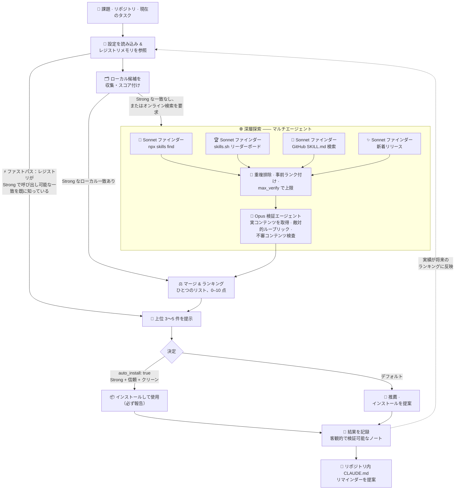

<div align="center">

# 🧭 autoskills

**[Claude Code](https://claude.com/claude-code) のためのメタスキル —— _最適なスキルを見つけるためのスキル。_**

[](../LICENSE)
[](https://claude.com/claude-code)
[](../SKILL.md)
[](https://www.npmjs.com/package/skills)

[English](../README.md) · [简体中文](README.zh-CN.md) · [繁體中文](README.zh-TW.md) · **日本語** · [한국어](README.ko.md)

</div>

---

`autoskills` は、エンジニアリング上の課題、コードベース、あるいは現在のタスクを受け取り、**ローカルのスキルライブラリ**と**オンラインのエコシステム**の両方から最も適したスキルを見つけ出し、ひとつのランキングにまとめて提示します。各候補を明確な品質ルーブリックで評価し、最適なものを推薦したうえで、有効だった結果を永続的なレジストリに記録するため、その後の検索はどんどん賢くなります。推薦後には、対象リポジトリの `CLAUDE.md` に自動メンテナンスされるリマインダーを書き込み、そのリポジトリでの今後のセッションがそれらのスキルを自動的に使うようにすることもできます。

オンライン検索のみに対応した `find-skills` スキルに対して、ローカル検索・スコアリング・永続的なメモリを追加し、これを置き換えます。

## ✨ 特長

- **ローカル + オンライン検索** —— 呼び出し可能なローカルスキルと `npx skills` エコシステムの両方から候補を集め、まとめてランキングします。
- **マルチエージェント深層探索** —— Claude Code ではオンライン探索が `Workflow` として実行されます。複数の Sonnet ファインダーが 4 つの角度（エコシステム、リーダーボード、GitHub、新着リリース）を並列に走査し、Opus 検証エージェントが各候補の実際のコンテンツを取得したうえで敵対的にスコア付けします。サブエージェントのみの環境では段階的に縮退し、サブエージェントを持たない環境（例: Codex）では完全に逐次的なフローになります。
- **品質ルーブリック** —— 各候補を Fit（適合度）、Trust（信頼性）、Track-record（実績）、Freshness（鮮度）、Specificity（具体性）の観点でスコア付けし、読み取れない／プレースホルダーだけのスキルを除外するサニティチェックを備えています。
- **設定でゲートされた自動インストール** —— `config.json` で `auto_install: true` を設定すると、Opus 検証で **Strong** かつ信頼性が基準を満たす（`trust_floor` デフォルト 2: 著名な作者または 1K+ インストール）スキルが自動的にインストール・使用されます —— 必ず報告され、決してサイレントには行われず、インストール／使用の前に必ずコンテンツに不審な指示がないか検査されます。デフォルトはオフです。
- **永続的なメモリ** —— ハイブリッドなレジストリ（グローバルストア + プロジェクトごとに 1 行のポインタ）が、どのスキルがどの課題を解決したかを記憶します。
- **検証可能なフィードバックループ** —— 作業完了時に、エージェントは使用した各スキルが本当に役立ったかを自己評価します。役立たなかった場合は、客観的で証拠に裏付けられた結果ノートとしてレジストリに記録され、以後のランキングが参照します。
- **可用性を考慮** —— いま実際に使えるスキルだけを推薦します。「優先したいが未同期」のスキルは、推薦せずにカタログに記録します。
- **リポジトリ内リマインダー** —— 同意のもとで冪等な `CLAUDE.md` ブロックを書き込み、そのリポジトリの今後のエージェントが使うべきスキルを把握できるようにします。

## 🔍 仕組み



Claude Code ではフルパワーで動作し、それ以外の環境では段階的に縮退します。

| ティア | 環境 | 実行方式 |
|---|---|---|
| 🟢 **Workflow** | Claude Code（`Workflow` ツール） | 並列 Sonnet ファインダー + 候補ごとに敵対的 Opus 検証エージェント |
| 🟡 **Agent** | サブエージェント対応の環境 | 並列ファインダーエージェント + 単一の Opus 級検証エージェント |
| 🔵 **Inline** | サブエージェントなし（例: Codex） | 同じ角度とルーブリックを、エージェント自身が逐次実行 |

## 📦 インストール

`autoskills` は Claude Code のスキルです。[`skills`](https://www.npmjs.com/package/skills) CLI でインストールします。

```bash
npx skills add B143KC47/autoskills -g -a claude-code -y
```

または手動でインストールします。

```bash
git clone https://github.com/B143KC47/autoskills.git
cp -r autoskills ~/.claude/skills/autoskills
```

これで `Skill` ツールから利用できるようになります。インストール先のフォルダは、`~/.claude/skills/autoskills/registry/` にあるグローバルレジストリのホームも兼ねています。

## 🚀 使い方

スキルを探したいときにいつでも呼び出してください。

- 「X にはどのスキルを使えばいい？」 /「X のためのスキルを探して」 /「X ができるスキルはある？」
- リポジトリ／フォルダを指して、どのスキルが当てはまるか尋ねる。
- 課題（リサーチ、ファインチューニング、評価、UI、デバッグ……）に取りかかるとき、スキルが役立ちそうな場面で。

ワークフロー: スキルのルートを解決 + 設定を読み込み → メモリを参照（レジストリに強い一致があればファストパス。ただしオンライン検索を明示的に求められた場合は無効）→ ローカル候補を収集・スコア付け → オンライン候補を深層探索（ローカルに Strong の一致がない場合、または明示的に求められた場合のみ）→ マージしてランキング → 上位 3〜5 件を提示 → 決定（設定に応じて自動インストール）→ 検証可能なノートで結果を記録 → リポジトリ内 `CLAUDE.md` リマインダーを提案。詳細は [`SKILL.md`](../SKILL.md) を参照してください。

### ⚙️ 設定

`SKILL.md` の隣に `config.json` を作成します（[`config.json.example`](../config.json.example) を参照）。

```jsonc
{
  "auto_install": false,   // true → 検証済み Strong スキルを確認なしでインストール・使用
  "min_tier": "strong",    // 自動インストールのティア下限（"strong" | "decent"）
  "trust_floor": 2,        // 自動インストールに必要な信頼スコア（2 = 著名な作者 / 1K+ インストール）
  "finders": 4,            // 深層探索ワークフローの並列ファインダー数
  "max_verify": 10         // 検索ごとの検証上限（除外された候補は必ずログに残る）
}
```

## 💡 例

> **あなた：**「技術トピックについて、引用付きで深く掘り下げるリサーチ向けのスキルを探して」

`autoskills` はレジストリから過去の成功例を思い出し、ローカル**と**オンラインの候補を集め、ルーブリックでそれぞれをスコア付けし、ひとつのランキングで回答します。

```text
1. deep-research · local · 9/10 Strong · ファンアウト型のウェブ検索、敵対的なファクトチェック、
   引用付きレポート —— 要望に合致 · すでに呼び出し可能
2. find-skills   · local · 5/10 Decent · スキルの発見/インストールは可能だがオンライン限定、
   統合機能なし · 呼び出し可能
   …オンライン候補も同じランキングにスコア付けされ、それぞれに `npx skills add …` の行が付きます
```

`autoskills` は **deep-research** を推薦し、この成功を記録するので、次のリサーチ系クエリはより速くランク付けされます —— さらに `CLAUDE.md` リマインダーの書き込みを提案し、そのリポジトリの今後のセッションが自動的にそれを思い出すようにします。

## 🗂️ リポジトリ構成

| パス | 役割 |
|---|---|
| `SKILL.md` | オーケストレーションのワークフロー（エントリーポイント） |
| `references/` | ルーブリック、深層探索ワークフローのテンプレート、レジストリ形式、フォルダスキャンのマップ、`CLAUDE.md` の手順 |
| `config.json.example` | 設定スキーマ（自動インストールのゲート、ファインダー数） |
| `scripts/` | 任意の依存関係なし Node ヘルパー（ローカルインデックス；`CLAUDE.md` の upsert） |
| `registry/` | 初期データ入りの「課題 → スキル」レジストリ |
| `tests/` | ドキュメント向けの Bash チェックと、スクリプト向けの振る舞いテスト |

## 🛠️ 開発

Bash と Node.js が必要です（npm 依存関係はありません）。フルスイートを実行します。

```bash
bash tests/check-integration.sh   # すべてのドキュメントチェック + 振る舞いテストを実行
```

## ⭐ サポート

autoskills が最適なスキルを見つけてくれたら、[**リポジトリにスターを**](https://github.com/B143KC47/autoskills) —— より多くのエージェントが自分のスキルに出会えるようになります。

## 📄 ライセンス

Apache License, Version 2.0 のもとでライセンスされています —— [`LICENSE`](../LICENSE) と [`NOTICE`](../NOTICE) を参照してください。

Copyright © 2026 KO Ho Tin.
