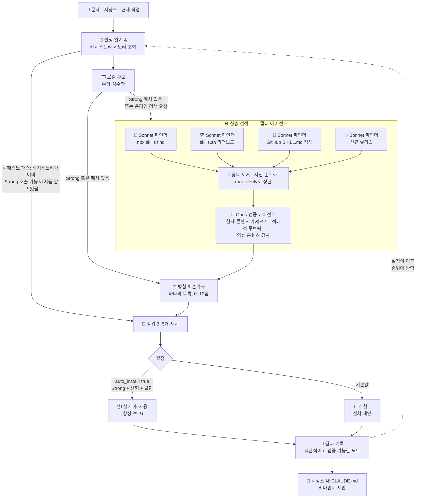

<div align="center">

# 🧭 autoskills

**[Claude Code](https://claude.com/claude-code)를 위한 메타 스킬 —— _올바른 스킬을 찾아 주는 스킬._**

[](../LICENSE)
[](https://claude.com/claude-code)
[](../SKILL.md)
[](https://www.npmjs.com/package/skills)

[English](../README.md) · [简体中文](README.zh-CN.md) · [繁體中文](README.zh-TW.md) · [日本語](README.ja.md) · **한국어**

</div>

---

`autoskills`는 엔지니어링 문제, 코드베이스, 또는 현재 작업을 입력으로 받아 **로컬 스킬 라이브러리**와 **온라인 생태계** 양쪽에서 가장 잘 맞는 스킬을 찾아내어 하나의 순위 목록으로 함께 보여 줍니다. 각 후보를 명확한 품질 루브릭으로 평가하고, 가장 적합한 것을 추천하며, 효과가 있었던 결과를 영속적인 레지스트리에 기록하므로 이후의 검색이 점점 더 똑똑해집니다. 추천 후에는 대상 저장소의 `CLAUDE.md`에 자동 관리되는 리마인더를 기록하여, 그 저장소의 이후 세션이 해당 스킬을 자동으로 사용하도록 할 수도 있습니다.

온라인 검색만 지원하는 `find-skills` 스킬에 로컬 검색, 점수화, 영속적 메모리를 더해 이를 대체합니다.

## ✨ 특징

- **로컬 + 온라인 검색** —— 호출 가능한 로컬 스킬과 `npx skills` 생태계 양쪽에서 후보를 모아 함께 순위를 매깁니다.
- **멀티 에이전트 심층 검색** —— Claude Code에서는 온라인 탐색이 `Workflow`로 실행됩니다. 여러 Sonnet 파인더가 네 가지 각도(생태계, 리더보드, GitHub, 신규 릴리스)를 병렬로 훑고, Opus 검증 에이전트가 각 후보의 실제 콘텐츠를 가져와 적대적으로 점수화합니다. 서브에이전트만 있는 환경에서는 단계적으로 축소되고, 서브에이전트가 없는 환경(예: Codex)에서는 완전히 순차적인 흐름으로 동작합니다.
- **품질 루브릭** —— 각 후보를 적합도(Fit), 신뢰도(Trust), 실적(Track-record), 최신성(Freshness), 구체성(Specificity) 기준으로 점수화하며, 읽을 수 없거나 자리표시자뿐인 스킬을 걸러 내는 정합성 검사를 둡니다.
- **설정으로 게이트되는 자동 설치** —— `config.json`에서 `auto_install: true`를 설정하면, Opus 검증에서 **Strong**이고 신뢰도 기준(`trust_floor` 기본 2: 저명한 작성자 또는 1K+ 설치)을 충족한 스킬이 자동으로 설치·사용됩니다 —— 항상 보고되며 결코 조용히 진행되지 않고, 설치/사용 전에 반드시 콘텐츠에 의심스러운 지시가 없는지 검사합니다. 기본값은 꺼짐입니다.
- **영속적 메모리** —— 하이브리드 레지스트리(전역 저장소 + 프로젝트별 한 줄 포인터)가 어떤 스킬이 어떤 문제를 해결했는지 기억합니다.
- **검증 가능한 피드백 루프** —— 작업이 끝나면 에이전트가 사용한 각 스킬이 실제로 도움이 되었는지 자체 평가합니다. 도움이 되지 않았다면 객관적이고 증거에 기반한 결과 노트로 레지스트리에 기록되어 이후 순위에 반영됩니다.
- **가용성 인식** —— 지금 바로 사용할 수 있는 스킬만 추천합니다. "선호하지만 아직 동기화되지 않은" 스킬은 추천하지 않고 목록에만 기록합니다.
- **저장소 내 리마인더** —— 동의를 받아 멱등한 `CLAUDE.md` 블록을 기록하여, 그 저장소의 이후 에이전트가 어떤 스킬을 써야 할지 알 수 있게 합니다.

## 🔍 동작 방식



Claude Code에서는 최대 성능으로 동작하고, 그 외 환경에서는 단계적으로 축소됩니다:

| 티어 | 환경 | 실행 방식 |
|---|---|---|
| 🟢 **Workflow** | Claude Code(`Workflow` 도구) | 병렬 Sonnet 파인더 + 후보마다 적대적 Opus 검증 에이전트 |
| 🟡 **Agent** | 서브에이전트를 지원하는 모든 환경 | 병렬 파인더 에이전트 + 단일 Opus급 검증 에이전트 |
| 🔵 **Inline** | 서브에이전트 없음(예: Codex) | 같은 각도와 루브릭을 에이전트가 직접 순차 실행 |

## 📦 설치

`autoskills`는 Claude Code 스킬입니다. [`skills`](https://www.npmjs.com/package/skills) CLI로 설치하세요:

```bash
npx skills add B143KC47/autoskills -g -a claude-code -y
```

또는 수동으로 설치합니다:

```bash
git clone https://github.com/B143KC47/autoskills.git
cp -r autoskills ~/.claude/skills/autoskills
```

그러면 `Skill` 도구에서 사용할 수 있습니다. 설치된 폴더는 `~/.claude/skills/autoskills/registry/`에 위치한 전역 레지스트리의 홈을 겸합니다.

## 🚀 사용법

스킬을 찾고 싶을 때 언제든 호출하세요:

- "X에는 어떤 스킬을 써야 해?" / "X를 위한 스킬을 찾아 줘" / "X를 할 수 있는 스킬이 있어?"
- 저장소/폴더를 가리키며 어떤 스킬이 적합한지 물어보기.
- 어떤 문제(리서치, 파인튜닝, 평가, UI, 디버깅……)에 착수할 때, 스킬이 도움이 될 만한 상황에서.

워크플로: 스킬 루트 해석 + 설정 읽기 → 메모리 조회(레지스트리에 강한 일치가 있으면 패스트 패스, 단 온라인 검색을 명시적으로 요청하면 무효) → 로컬 후보 수집·점수화 → 온라인 후보 심층 검색(로컬에 Strong 일치가 없거나 명시적으로 요청한 경우에만) → 병합·순위화 → 상위 3~5개 제시 → 결정(설정에 따라 자동 설치) → 검증 가능한 노트로 결과 기록 → 저장소 내 `CLAUDE.md` 리마인더 제안. 자세한 내용은 [`SKILL.md`](../SKILL.md)를 참고하세요.

### ⚙️ 설정

`SKILL.md` 옆에 `config.json`을 만드세요([`config.json.example`](../config.json.example) 참고):

```jsonc
{
  "auto_install": false,   // true → 검증된 Strong 스킬을 묻지 않고 설치·사용
  "min_tier": "strong",    // 자동 설치 티어 하한("strong" | "decent")
  "trust_floor": 2,        // 자동 설치에 필요한 신뢰 점수(2 = 저명한 작성자 / 1K+ 설치)
  "finders": 4,            // 심층 검색 워크플로의 병렬 파인더 수
  "max_verify": 10         // 검색당 검증 상한(제외된 후보는 반드시 로그에 남음)
}
```

## 💡 예시

> **당신:** "기술 주제에 대해 깊이 있고 출처가 표기된 리서치를 해 주는 스킬을 찾아 줘"

`autoskills`는 레지스트리에서 과거의 성공 사례를 떠올리고, 로컬**과** 온라인 후보를 모아 루브릭으로 각각 점수를 매긴 뒤, 하나의 순위 목록으로 답합니다:

```text
1. deep-research · local · 9/10 Strong · 팬아웃 웹 검색, 적대적 사실 검증,
   출처 표기 보고서 —— 요구에 부합 · 이미 호출 가능
2. find-skills   · local · 5/10 Decent · 스킬을 발견/설치하지만 온라인 전용,
   종합 기능 없음 · 호출 가능
   …온라인 후보도 같은 목록에 점수화되며, 각 항목에 `npx skills add …` 명령 줄이 함께 붙습니다
```

`autoskills`는 **deep-research**를 추천하고 이 성공을 기록하므로, 다음 리서치 쿼리는 더 빠르게 순위가 매겨집니다 —— 또한 `CLAUDE.md` 리마인더 작성을 제안하여, 그 저장소의 이후 세션이 자동으로 이를 떠올리게 합니다.

## 🗂️ 저장소 구조

| 경로 | 용도 |
|---|---|
| `SKILL.md` | 오케스트레이션 워크플로(진입점) |
| `references/` | 루브릭, 심층 검색 워크플로 템플릿, 레지스트리 형식, 폴더 스캔 매핑, `CLAUDE.md` 절차 |
| `config.json.example` | 설정 스키마(자동 설치 게이트, 파인더 수) |
| `scripts/` | 선택적 의존성 없는 Node 헬퍼(로컬 인덱스; `CLAUDE.md` upsert) |
| `registry/` | 초기 데이터가 담긴 「문제 → 스킬」 레지스트리 |
| `tests/` | 문서용 Bash 검사와 스크립트용 동작 테스트 |

## 🛠️ 개발

Bash와 Node.js가 필요합니다(npm 의존성 없음). 전체 스위트를 실행하세요:

```bash
bash tests/check-integration.sh   # 모든 문서 검사 + 동작 테스트 실행
```

## ⭐ 응원하기

autoskills가 알맞은 스킬을 찾아 주었다면 [**저장소에 스타를**](https://github.com/B143KC47/autoskills) 눌러 주세요 —— 더 많은 에이전트가 자신의 스킬을 찾는 데 도움이 됩니다.

## 📄 라이선스

Apache License, Version 2.0에 따라 라이선스됩니다 —— [`LICENSE`](../LICENSE)와 [`NOTICE`](../NOTICE)를 참고하세요.

Copyright © 2026 KO Ho Tin.
